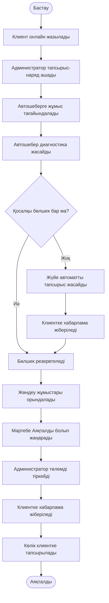

# Activity диаграммасы: Автокөлікті жөндеу процесі

```mermaid
flowchart TD
    A([Бастау]) --> B[Клиент онлайн жазылады]
    B --> C[Администратор тапсырыс-наряд ашады]
    C --> D[Автошеберге жұмыс тағайындалады]
    D --> E[Автошебер диагностика жасайды]
    E --> F{Қосалқы бөлшек бар ма?}
    F -- Иә --> G[Бөлшек резервтеледі]
    F -- Жоқ --> H[Жүйе автоматты тапсырыс жасайды]
    H --> I[Клиентке хабарлама жіберіледі]
    I --> G
    G --> J[Жөндеу жұмыстары орындалады]
    J --> K[Мәртебе Аяқталды болып жаңарады]
    K --> L[Администратор төлемді тіркейді]
    L --> M[Клиентке хабарлама жіберіледі]
    M --> N[Көлік клиентке тапсырылады]
    N --> O([Аяқталды])
```
