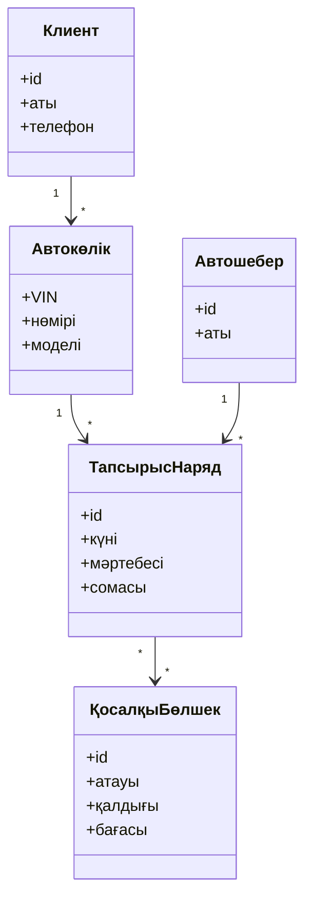

# Класс диаграммасы

```mermaid
classDiagram
    class Клиент {
        +id
        +аты
        +телефон
    }
    class Автокөлік {
        +VIN
        +нөмірі
        +моделі
    }
    class ТапсырысНаряд {
        +id
        +күні
        +мәртебесі
        +сомасы
    }
    class Автошебер {
        +id
        +аты
    }
    class ҚосалқыБөлшек {
        +id
        +атауы
        +қалдығы
        +бағасы
    }
    Клиент "1" --> "*" Автокөлік
    Автокөлік "1" --> "*" ТапсырысНаряд
    Автошебер "1" --> "*" ТапсырысНаряд
    ТапсырысНаряд "*" --> "*" ҚосалқыБөлшек
```
