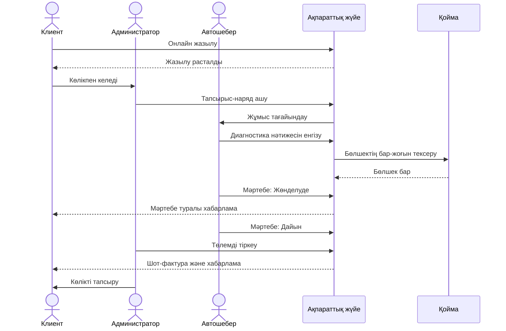

# Sequence диаграммасы: Жөндеуге жазылу және орындау

```mermaid
sequenceDiagram
    actor C as Клиент
    actor A as Администратор
    actor M as Автошебер
    participant S as Ақпараттық жүйе
    participant W as Қойма

    C->>S: Онлайн жазылу
    S-->>C: Жазылу расталды
    C->>A: Көлікпен келеді
    A->>S: Тапсырыс-наряд ашу
    S->>M: Жұмыс тағайындау
    M->>S: Диагностика нәтижесін енгізу
    S->>W: Бөлшектің бар-жоғын тексеру
    W-->>S: Бөлшек бар
    M->>S: Мәртебе: Жөнделуде
    S-->>C: Мәртебе туралы хабарлама
    M->>S: Мәртебе: Дайын
    A->>S: Төлемді тіркеу
    S-->>C: Шот-фактура және хабарлама
    A->>C: Көлікті тапсыру
```
