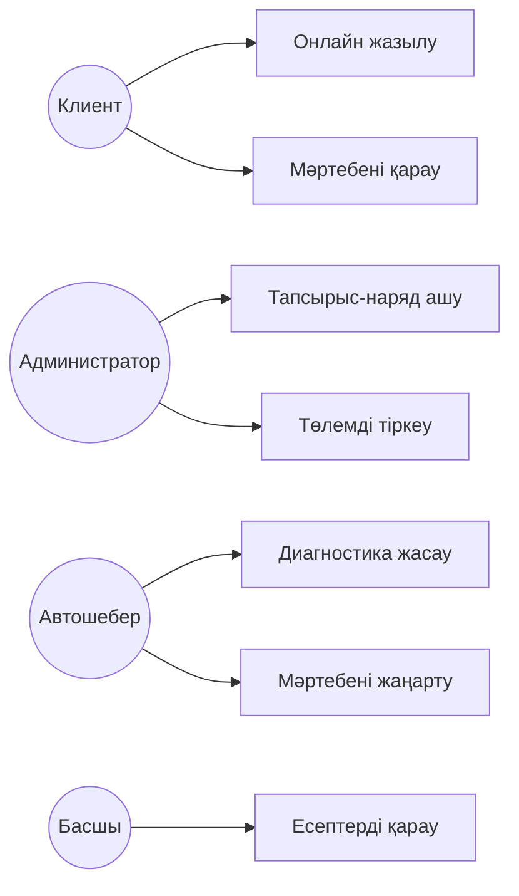

# Use Case диаграммасы

```mermaid
flowchart LR
    Клиент((Клиент))
    Админ((Администратор))
    Шебер((Автошебер))
    Басшы((Басшы))

    Клиент --> UC1[Онлайн жазылу]
    Клиент --> UC2[Мәртебені қарау]
    Админ --> UC3[Тапсырыс-наряд ашу]
    Админ --> UC4[Төлемді тіркеу]
    Шебер --> UC5[Диагностика жасау]
    Шебер --> UC6[Мәртебені жаңарту]
    Басшы --> UC7[Есептерді қарау]
```
